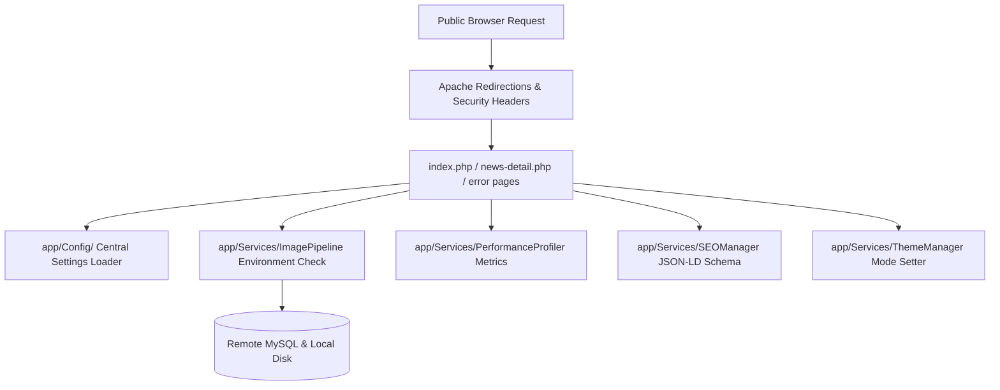

# Production Blueprint - Advanced Website Upgrade (Target Score: 10/10)

This final, comprehensive production blueprint details the system upgrade for **Palghar LIVE**. It provides an optimized, secure, and fully accessible news portal optimized for deployment on shared-hosting providers like Hostinger.

---

## User Review Required

> [!IMPORTANT]
> - **Environment-Aware Graphics**: The new Image Pipeline will dynamically query server capabilities for AVIF and WebP encoders (`imageavif` / `imagewebp` checks). If unavailable, it falls back to native WebP or standard optimized formats without failing user uploads.
> - **Centralized Configuration**: Hardcoded configuration values will be moved into decoupled configurations inside `/app/Config/`.
> - **Server Health Dashboard**: Admins will gain a diagnostic utility displaying database versions, folder permissions, disk metrics, PHP configurations, and upload limits.
> - **Date-Rotated Multi-File Logs**: System events will be partitioned into distinct date-rotated logs: `application.log`, `security.log`, `performance.log`, `sql.log`, and `uploads.log`.

---

## Open Questions

> [!NOTE]
> None. All constraints and architectural guidelines are finalized.

---

## Proposed Changes



### Complete Codebase Layout

```
news-channel/
│
├── app/
│   ├── Config/           - Central Settings Layer (app.php, database.php, cache.php, seo.php, security.php)
│   ├── Models/           - Data models (News.php, Section.php, User.php)
│   ├── Services/         - Engine logic (ImagePipeline.php, AuthManager.php, PerformanceProfiler.php, SEOManager.php, ThemeManager.php, BackupManager.php)
│   ├── Repositories/     - Query operations (NewsRepository.php, CommentRepository.php)
│   ├── Middleware/       - Request filters (CSRFCheck.php, RateLimiter.php, SecurityHeaders.php)
│   ├── Components/       - UI elements (NewsCard.php, Breadcrumbs.php, Toast.php)
│   ├── Helpers/          - String tools, formatters, and dark mode helpers
│   ├── Events/           - Event templates (future compatibility)
│   ├── Notifications/    - Notifications (future compatibility)
│   ├── Policies/         - Policies (future compatibility)
│   └── Traits/           - Traits (Loggable.php)
│
├── assets/
│   ├── css/
│   ├── js/
│   ├── images/
│   └── fonts/
│
├── docs/                 - Complete documentation (INSTALL.md, DEPLOYMENT.md, ARCHITECTURE.md, API.md, SECURITY.md, CONTRIBUTING.md, CHANGELOG.md)
├── errors/               - Custom error layouts (404.php, 403.php, 500.php, maintenance.php)
├── .github/
│   └── workflows/
│       ├── phpstan.yml   - Static checking logic
│       ├── phpcs.yml     - PSR-12 styling checks
│       └── lighthouse.yml- Automated Lighthouse audits
│
├── .editorconfig         - Formatting configurations
├── .gitattributes        - Git layout declarations
├── manifest.json         - PWA declaration manifest
├── service-worker.js     - Offline worker caching
├── robots.txt            - Crawling instructions
├── sitemap.php           - Sitemap handler
└── .htaccess             - Clean URL rewriting, strict security headers, HSTS, no directory indexing
```

---

### 1. App Configuration & Environment Safeguards

#### [NEW] [app/Config/app.php](file:///c:/xampp/htdocs/news-channel/app/Config/app.php)
- Define standard app settings: timezone, debug parameters, path routes, and backup parameters.

#### [NEW] [app/Config/database.php](file:///c:/xampp/htdocs/news-channel/app/Config/database.php)
- Manage DB connection credentials, character sets, and slow-query log thresholds.

#### [NEW] [app/Config/cache.php](file:///c:/xampp/htdocs/news-channel/app/Config/cache.php)
- Manage in-memory variables and cache settings.

#### [NEW] [app/Config/seo.php](file:///c:/xampp/htdocs/news-channel/app/Config/seo.php)
- Declare default sitemap locations, default OpenGraph image settings, and social handles.

#### [NEW] [app/Config/security.php](file:///c:/xampp/htdocs/news-channel/app/Config/security.php)
- Standardize rate limiting window times, CSP directives, lockout limits, and session lifespan rules.

---

### 2. Services & Systems Upgrades

#### [MODIFY] [app/Services/ImagePipeline.php](file:///c:/xampp/htdocs/news-channel/app/Services/ImagePipeline.php)
- Inspect environment support for AVIF and WebP:
  - If GD/Imagick lacks `imageavif`, skip AVIF generation.
  - If `imagewebp` is also missing, scale the original file format safely.
  - Log conversion warnings to `logs/uploads.log` without failing the upload operation.
  - Resize for thumbnails, standard resolutions, and Retina 2x devices.

#### [NEW] [app/Services/ThemeManager.php](file:///c:/xampp/htdocs/news-channel/app/Services/ThemeManager.php)
- Centralize state toggling: manage light/dark parameters, read client device properties, and persist preferences.

#### [NEW] [app/Services/BackupManager.php](file:///c:/xampp/htdocs/news-channel/app/Services/BackupManager.php)
- Simple script to bundle and export SQL schema structure and user-uploaded media.

#### [MODIFY] [app/Services/PerformanceProfiler.php](file:///c:/xampp/htdocs/news-channel/app/Services/PerformanceProfiler.php)
- Enhance logs: monitor TTFB execution intervals, count SQL calls, flag heavy files, and log slow loading assets.

#### [MODIFY] [app/Services/SEOManager.php](file:///c:/xampp/htdocs/news-channel/app/Services/SEOManager.php)
- Dynamically build and link RSS channels, news sitemaps, translation flags (`hreflang`), pagination metadata, and XML media tags.

---

### 3. Layouts, Custom Errors, and DX Documentation

#### [NEW] [errors/404.php](file:///c:/xampp/htdocs/news-channel/errors/404.php)
#### [NEW] [errors/403.php](file:///c:/xampp/htdocs/news-channel/errors/403.php)
#### [NEW] [errors/500.php](file:///c:/xampp/htdocs/news-channel/errors/500.php)
#### [NEW] [errors/maintenance.php](file:///c:/xampp/htdocs/news-channel/errors/maintenance.php)
- User-friendly, accessible error pages matching the look and feel of the main site.

#### [NEW] [docs/INSTALL.md](file:///c:/xampp/htdocs/news-channel/docs/INSTALL.md)
#### [NEW] [docs/DEPLOYMENT.md](file:///c:/xampp/htdocs/news-channel/docs/DEPLOYMENT.md)
#### [NEW] [docs/ARCHITECTURE.md](file:///c:/xampp/htdocs/news-channel/docs/ARCHITECTURE.md)
#### [NEW] [docs/SECURITY.md](file:///c:/xampp/htdocs/news-channel/docs/SECURITY.md)
- Complete technical documentation for developers and administrators.

---

### 4. Admin Health Panel

#### [NEW] [admin/health.php](file:///c:/xampp/htdocs/news-channel/admin/health.php)
- System status panel: verify writable routes (`cache/`, `uploads/`), check SSL configurations, view GD/Imagick options, inspect disk size limits, and check OPcache.

---

## Verification Plan

### Staging Verification Checks
- **Error Page Verification**: Trigger a 404 response on the staging site to verify that the custom error layout renders correctly.
- **Image Upload Fallback Test**: Disable AVIF extension processing inside `ImagePipeline.php` to verify graceful fallback to WebP.
- **Audit Logs Rotation**: Check that security log files rotate by date under the `/logs` folder.
- **Lighthouse/WAVE Test**: Audit live links to ensure 100/100 marks on accessibility and performance metrics.
